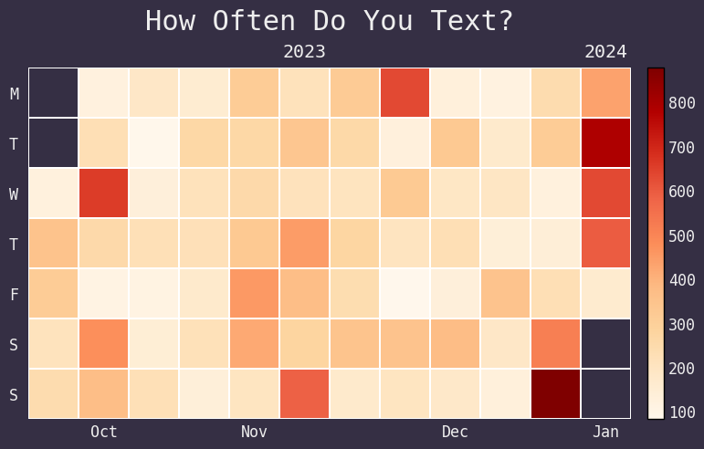

## Overview

  
   

## Texting Through Time

  
   

  
   

## Texting Personalities

  
   

  
   

   

  

  <b>Legend</b> 
  <b>Ego:</b> Words referring to oneself (e.g., I, my, me) 
  <b>Alter:</b> Words referring to the other (e.g., you, your) 
  <b>Collective:</b> Words referring to both (e.g., us, our)

## Language

  
   

  
   

## Emojis

  

  

## iMessage Reactions

  

